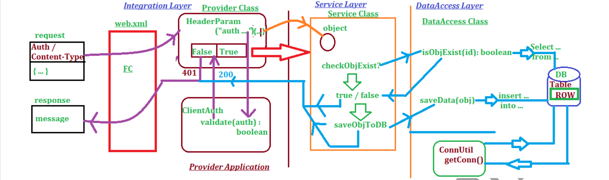

# Jersey_Design2_Assisment
<<<<<<< HEAD
Assessment

Design: #2

 To implement Provider Application we are using 3 Layers.
1. Integration Layer
2. Service Layer
3. DataAccess Layer

    If request is made by Client Application, it will be submitted to
   FrontController.

    FC identify the Provider Class based on Path and HttpRequest is given to it.

    HttpRequest contains two header params, One is Authorization, 2nd is
   Content-Type.

    If Content-Type not matched with Provider (JSON) it returns 415.

    Authorization valus is sent to ClientAuth Class for validate Client.

    It returns Boolean, ie true – valid Client, false – invalid Client return with  401.

    In case of valid Client(true), continue to Service Layer Class. 
Here JSON -
Object verify object id already exist in DB or not? Using DAL with select
Query ….

 Select …. --true – exist , false -- not exist.

 If true don’t save return with error message else save into DB as row (
insert … into …). Return final response object back to Client Application.

 Here also define one ConnectionUtil to get one Connection Object
(Singleton Design).
=======
Assisment Jersey
>>>>>>> b2f7fad7c5a7cf6f837c0abe14dd3dad58617934
